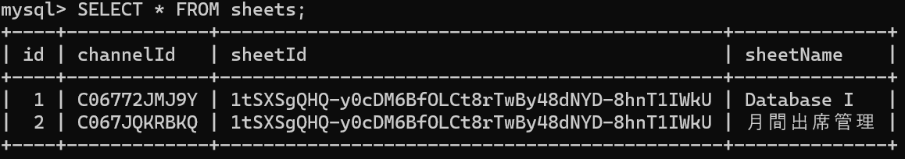

# 出席管理アプリ　AME仕様書
制作　卒業企画チーム_HMN

メンバー

HIMANSHU GAUTAM　武藤ショーン凪翔　與那覇祥人

 

 

## サービスのURL

 

## 使い方
AMEではslackとスプレッドシートを使って出席を行います。

slackの教科ごとのチャンネルで出席と入力することで出席になります。

出席状況は時間内・遅刻・欠席の三つに分けられており、シートに値が出力されます。

時間内であれば２、遅刻は１、17時までに出席がない場合は欠席となり０がシートに出力されます。

## 主な機能一覧
| 管理者画面 |　確認画面 |
| ---- | ---- |
|  |  |
| ここでは管理者がシートの確認・作成・削除を行う | フォルダから確認・修正したいシートを選択 |

| 作成画面 |　削除画面 |
| ---- | ---- |
|  |  |
| slackのチャンネルID、シートID、シート名を入力 | 作成画面と同様の入力を行う |

| 時間内の場合 |　シート画面 |
| ---- | ---- |
|  |  |
| slackで出席を入力すると時間内であれば通常のメッセージを出力 | シートには2の値を出力 |

| 遅刻の場合 |　シート画面 |
| ---- | ---- |
|  |  |
| 遅刻の場合は遅刻メッセージを出力 | シートには1の値を出力 |

 

## 使用環境

| Category          | Technology Stack                                     |
| ----------------- | --------------------------------------------------   |
| OS                | Windows11                                            |
| frontend          | HTML/CSS, TypeScript                                 |
| Backend           | TypeScript, Node.js                                  |
| Infrastructure    | GCP                     　　　　　　　　　　　　　　　　|

 

## 前提条件
・Node.js v20.10.0 以降
・npm v10.2.3 以降
・ngrok v3.4.0 以降

## インストール
このリポジトリのクローンを作成します

実行してnpm install依存関係をインストールします。

#### slackの設定
ブラウザもしくはアプリでslackの登録

#### slackappの設定
##### 1 slackのメニューからapp設定に移動

##### 2 slackAppdirectoryに移動したら右上のbuildに移動

##### 3 Yourappsに移動したらcreateNewappを選択

##### 4 上のFrom scratchを選択

##### 5 アプリ名と使用するワークスペースを選択し、作成

##### 6 OAuth & Permissionsでボットとユーザーのトークンスコープの追加
追加するトークンスコープ一覧

##### botのトークンスコープ

##### app_mentions:read:

bot が直接メンションされたメッセージを取得する権限です。この権限がないと、ボットがメンションされたかどうかを確認できません。

##### channels:history:

パブリックチャンネル内のメッセージとコンテンツを表示する権限です。Google_Sheet_bot が追加されたパブリックチャンネルでのメッセージを取得できます。

##### channels:read:

ワークスペース内のパブリックチャンネルに関する基本情報を表示する権限です。チャンネルの一覧やメタデータなどを取得できます。

##### chat:write:

bot としてメッセージを送信する権限です。Slack上でのメッセージの送信に使用されます。

##### im:history:

bot が追加されたダイレクトメッセージ内のメッセージとコンテンツを表示する権限です。

##### im:read:

ダイレクトメッセージに関する基本情報を表示する権限です。ダイレクトメッセージの一覧やメタデータなどを取得できます。

##### im:write:

ユーザーとのダイレクトメッセージを開始する権限です。

##### reactions:read:

bot が追加されたチャンネルや会話での絵文字リアクションとそれに関連するコンテンツを表示する権限です。

##### users.profile:read:

ワークスペース内の人々のプロファイルに関する詳細情報を表示する権限です。

##### users:read:

ワークスペース内の人々の一覧を表示する権限です。

##### ユーザーのトークンスコープ

##### channels:history

ユーザーのパブリック チャネル内のメッセージやその他のコンテンツを表示する

##### 7 Basic Informationに移動し、Install your appでappをワークスペースにインストールする。

##### 8 インストールが成功したら、Basic InformationにあるSigning SecretとOAuth & PermissionsのBot User OAuth Tokenを取得する

##### 9 ワークスペースに戻り、利用するチャンネルの詳細を開き、インテグレーションにあるアプリを追加するから作成したappを追加

 

### DBの設定

DBに以下のようにslackのチャンネルID、スプレッドシートのシートID、シート名を追加する

## よくある質問/FAQ

 

## お問い合わせ
email n22030@std.it-college.ac.jp

 

## 
Copyright (c) 2024 卒業企画チーム_HMN
 
